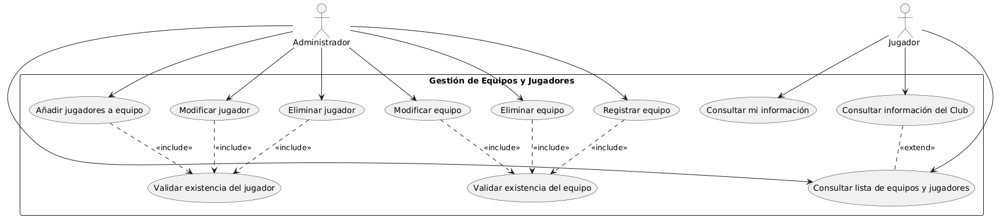
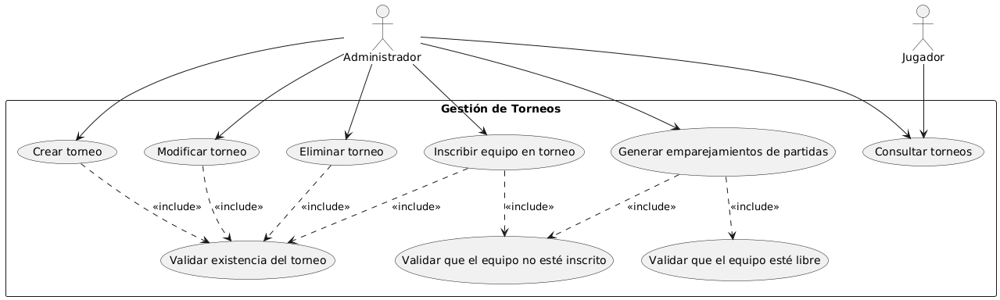
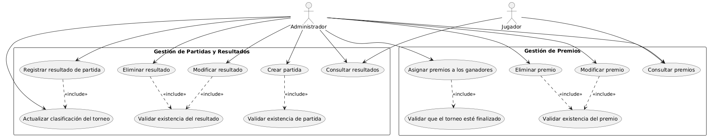
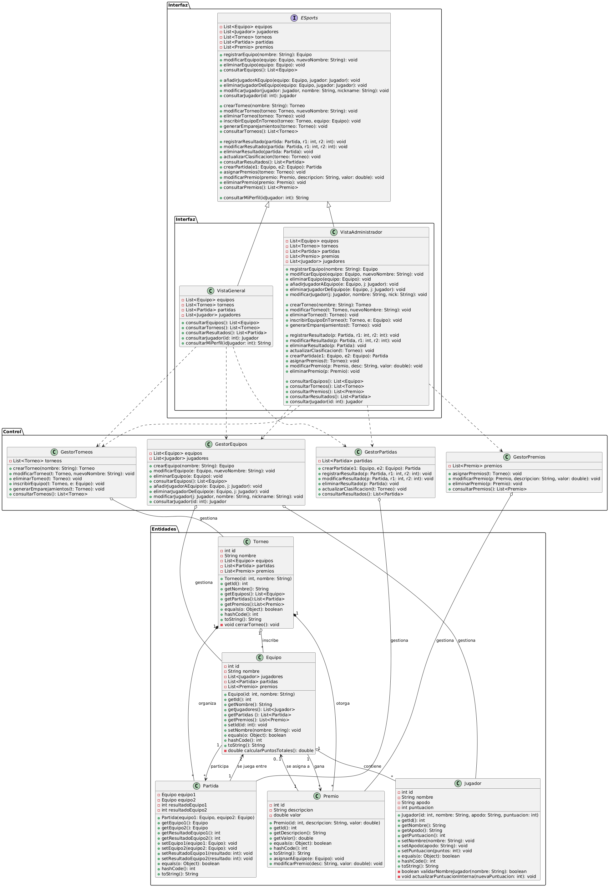

# 🕹️ Sistema de Gestión de Torneos de ESports

## 👤 Autor
**Samantha Mohedano Barrena**  
[SamanthaMB](https://github.com/SamanthaMB)
[🔗 Torneo-ESports-UML](https://github.com/SamanthaMB/Torneo-ESports-UML.git)
---

## 📌 Descripción del Proyecto

Este proyecto consiste en el desarrollo de un sistema de gestión de torneos de ESports aplicando los principios de **Programación Orientada a Objetos (POO)** y utilizando diagramas **UML** para su modelado. Se ha diseñado un sistema completo que permite administrar jugadores, equipos, torneos, partidas y premios, tanto desde el punto de vista del **administrador del sistema** como de los **jugadores**.

### Funcionalidades Principales:
- **Gestión de Equipos y jugadores**: Crear y gestionar equipos de jugadores.
- **Gestión de Torneos**: Crear y gestionar torneos y emparejamientos.
- **Gestión de Partidas y Resultados**: Organizar las partidas y registrar los resultados.
- **Consultas** disponibles tanto para administradores como para jugadores.

*Este sistema está diseñado para ser fácilmente escalable y adaptable a diferentes tipos de competiciones de ESports*.
---

## 🧠 Análisis del problema y requisitos del sistema

### 🎭 Actores del sistema:

- **Administrador**: Tiene acceso completo al sistema y puede gestionar todas las entidades.
- **Jugador**: Solo puede consultar información de equipos, torneos, resultados, premios, etc.

### 🛠️ Acciones por actor

| Actor         | Acciones principales |
|---------------|----------------------|
| **Administrador** | Añadir/modificar/eliminar jugadores, equipos, torneos, partidas y premios. Inscribir equipos, registrar resultados, generar emparejamientos, asignar premios. |
| **Jugador**       | Consultar información del equipo, torneos, resultados, premios y su perfil. |

### 🔗 Relaciones entre entidades

| Entidad 1 | Entidad 2 | Tipo | Cardinalidad | Explicación |
|----------|-----------|------|--------------|-------------|
| Equipo   | Jugador   | Agregación | 1:N | Un equipo tiene varios jugadores, pero los jugadores pueden existir sin equipo inicialmente. |
| Torneo   | Equipo    | Agregación | 1:N | Un torneo contiene múltiples equipos. |
| Torneo   | Partida   | Composición | 1:N | Las partidas dependen del torneo. |
| Partida  | Equipo    | Asociación bidireccional N:M | 1 partida ↔ 2 equipos | Una partida enfrenta a dos equipos. |
| Torneo   | Premio    | Composición | 1:N | Los premios están ligados al torneo. |
| Premio   | Equipo    | Asociación bidireccional | 1 premio → 1 equipo / 1 equipo → * premios | Un equipo puede ganar varios premios. |

---

## 🧩 Identificación de los casos de uso

### 1️⃣ Gestión de equipos y jugadores

**Administrador:**
- Añadir/modificar/eliminar jugador.
- Registrar/modificar/eliminar equipo.
- Consultar lista de equipos y jugadores.

**Jugador:**
- Consultar lista de equipos y jugadores.
- Consultar información del equipo.
- Consultar su perfil.

### 2️⃣ Gestión de torneos

**Administrador:**
- Crear/modificar/eliminar torneo.
- Inscribir equipos.
- Generar emparejamientos.
- Consultar torneos.

**Jugador:**
- Consultar torneos.

### 3️⃣ Gestión de partidas y resultados

**Administrador:**
- Crear partida.
- Registrar/modificar/eliminar resultados.
- Consultar resultados.
- Actualizar clasificación.

**Jugador:**
- Consultar resultados.

### 4️⃣ Gestión de premios

**Administrador:**
- Asignar/modificar/eliminar premios.
- Consultar premios.

**Jugador:**
- Consultar premios.
---

## 🧱 Identificación de clases y relaciones

### 🔹 Clases de Entidad

| Clase   | Atributos | Métodos principales |
|---------|-----------|---------------------|
| **Equipo** | id, nombre, jugadores, partidas, premios | Constructor, getters/setters, `calcularPuntosTotales()` |
| **Jugador** | id, nombre, apodo, puntuacion | Constructor, getters/setters, `validarNombre()` |
| **Torneo** | id, nombre, equipos, partidas, premios | Constructor, getters/setters, `cerrarTorneo()` |
| **Partida** | equipo1, equipo2, resultadoEquipo1, resultadoEquipo2 | Constructor, getters/setters |
| **Premio** | id, descripcion, valor | Constructor, getters/setters, `asignarAEquipo()` |

### 🔸 Clases de Control
Los gestores agregan a las Entidades.

| Clase         | Atributos                    | Funciones |
|---------------|------------------------------|-----------|
| **GestorEquipos** | List<Equipo>, List<Jugador> | Gestionar equipos y jugadores |
| **GestorTorneos** | List<Torneo>               | Gestionar torneos y emparejamientos |
| **GestorPartidas** | List<Partida>             | Gestionar partidas y resultados |
| **GestorPremios** | List<Premio>               | Gestionar premios |

### 🖥️ Clases de Interfaz

- **ESports**: Interfaz general con los métodos del sistema.
- **VistaAdministrador**: Implementa funcionalidades completas para el administrador.
- **VistaGeneral**: Consulta de información general para jugadores.
Las clases vistas implementan la interfaz ESports y a su vez dependen de los gestores para ejecutar las acciones del negocio y acceder a los datos de las entidades.
---

## 🧮 Justificación del diseño

Este sistema ha sido diseñado utilizando la metodología de Programación Orientada a Objetos (POO), organizando las clases en tres categorías principales: **Entidades, Control e Interfaz**. Cada una de estas categorías tiene responsabilidades específicas, lo que permite una estructura limpia, modular y fácil de mantener:
-**Entidades**: Son las clases principales que representan los elementos fundamentales del sistema como Equipo, Jugador, Torneo, Partida y Premio. Estas clases manejan los datos principales y las relaciones entre ellos.
-**Control**: Son clases encargadas de gestionar la lógica de negocio, como GestorEquipos, GestorTorneos, GestorPartidas y GestorPremios, las cuales manipulan y gestionan las entidades según las necesidades del sistema.
-**Interfaz**: Son las clases que interactúan con los usuarios, proporcionando una interfaz para la interacción, tanto para administradores como para jugadores. Ejemplos de estas clases son VistaAdministrador y VistaGeneral.
Además, el sistema usa diagramas UML para visualizar las relaciones entre las clases y sus interacciones, facilitando el entendimiento del diseño y la implementación del sistema.
---

## 📈 Diagramas UML

Los diagramas fueron generados usando **PlantUML** a partir del código fuente UML.

### 📌 Diagrama de Casos de Uso - Gestión de Equipos y Jugadores

### 📌 Diagrama de Casos de Uso - Gestión de Torneos

### 📌 Diagrama de Casos de Uso - Gestión de Premios

### 📌 Diagrama de Clases UML

---

## 📁 Estructura del Proyecto

torneo-esports-uml/ ├── docs/ │ └── Proyecto.pdf ├── diagrams/ │ ├── casos-uso-equipos-jugadores.png │ ├── casos-uso-torneos.png │ ├── casos-uso-resultados-premios.png │ ├── clases.png ├── README.md └── .gitignore
---

## ✅ Conclusión
Este proyecto me ha permitido aplicar de forma práctica todos los conocimientos adquiridos hasta ahora sobre Programación Orientada a Objetos y el diseño de sistemas con UML. Me ha costado bastante trabajo organizar todas las clases, definir correctamente las relaciones y lograr que el sistema sea coherente y funcional.

He aprendido mucho durante el proceso, especialmente sobre cómo modelar correctamente un sistema complejo utilizando buenas prácticas de diseño. Estoy satisfecha con el resultado final, ya que considero que he logrado construir un sistema bien estructurado, claro y funcional.

Aunque ha supuesto un reto, ha sido muy gratificante ver cómo todo encajaba al final. Creo que es un buen trabajo y refleja el esfuerzo y dedicación que le he puesto. 🎮💻✨
